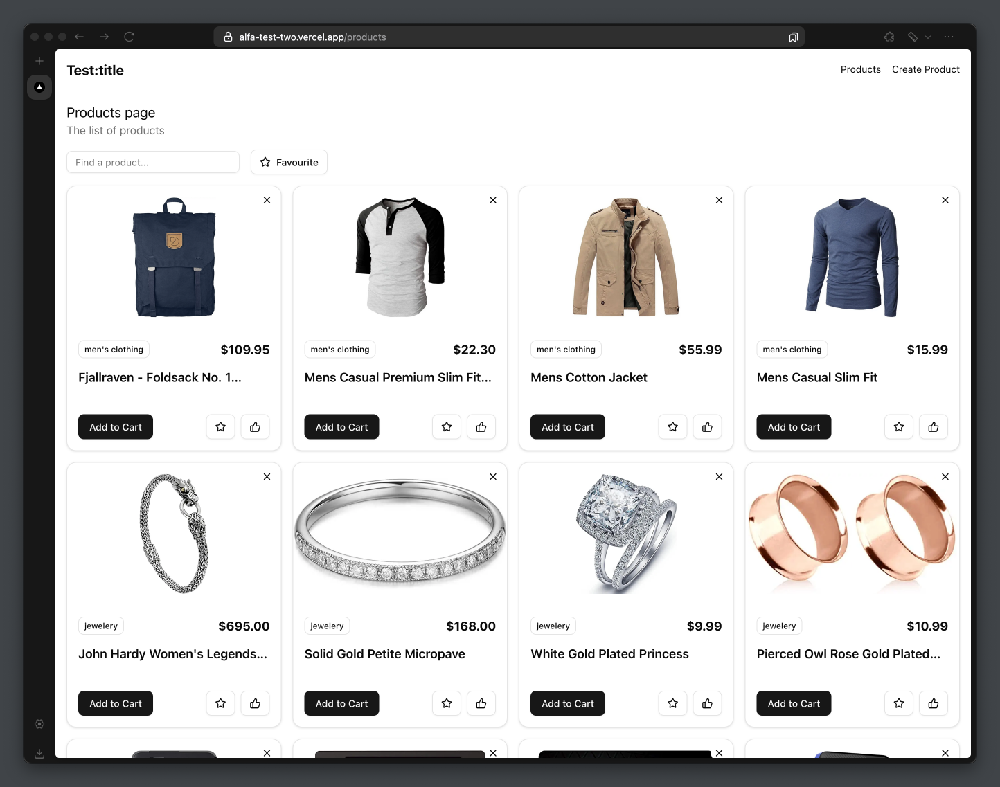

# Alfa Test Project

## Overview

This project is a demonstration of a Next.js application designed to manage and display a list of products. It showcases my ability to integrate modern web technologies and implement efficient state management using Zustand.

## Key Features

- **Dynamic Product Management**: Create, delete, and filter products with ease.
- **User Interaction**: Toggle favourites and likes for personalized user experience.
- **Responsive Design**: Ensures optimal viewing across various devices.

## Technologies Used

- **Next.js**: For server-side rendering and seamless navigation.
- **Zustand**: Lightweight state management for React applications.
- **Tailwind CSS**: Utility-first CSS framework for styling.
- **Shadcn UI**: Component library for building UI components.
- **TypeScript**: For type safety and enhanced development experience.

## Screenshot



## Installation

To explore the project locally, follow these steps:

1. Clone the repository:
   ```bash
   git clone https://github.com/yourusername/yourrepository.git
   ```

2. Navigate to the project directory:
   ```bash
   cd yourrepository
   ```
3. Install dependencies:
   ```bash
   npm install
   ```
4. Run the development server:
   ```bash
   npm run dev
   ```
