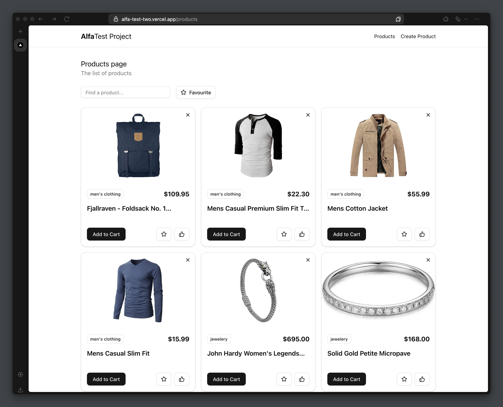

# Alfa Test Project



## Overview

This project is a Single Page Application (SPA) developed as a test assignment. The main goal is to display a list of product cards, each showing an image and information fetched from a public API or created by the user. The design is simple and clean, focusing on functionality.

## Features

1. **Product List**:
   - A list of products on the `/products` page.
   - Each card includes:
     - A like icon that toggles a like state, changing color when liked.
     - A delete icon to remove the card from the list.
     - A filter to view all cards or only the liked ones.
     - Truncated text to maintain uniform card height.
     - Clicking anywhere on the card (except icons) navigates to a detailed view.

2. **Product Detail**:
   - On the `/products/:id` page, display detailed information about the product.
   - Include a button to navigate back to the main product list.

3. **Product Creation**:
   - On the `/create-product` page, implement a form for product creation.
   - The form includes mandatory fields with basic validation.
   - On submission, save the data to the internal store.

## Technology Stack

-  **TypeScript**
-  **Next.js**
-  **Zustand** for state management
-  **Shadcn/ui**

## Installation

To run this project locally, follow these steps:

1. Clone the repository:
  ```bash
  git clone https://github.com/agapovk/alfa-test.git
  ```
2.	Navigate to the project directory:
  ```bash
  cd alfa-test
  ```
3.	Install dependencies:
  ```bash
  npm install
  ```
4.	Start the application:
  ```bash
  npm run dev
  ```

## Deployment
The project is deployed on Vercel. Please find the live version [Deploy on Vercel](https://alfa-test-two.vercel.app/products)

## Usage
  - Navigate to ⁠/products to view the product list.
  - Use the like, favourite and delete icons on each card to interact with the products.
  - Click on a product card to view detailed information.
  - Create new products via the ⁠/create-product page.
